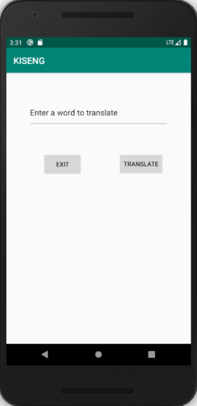
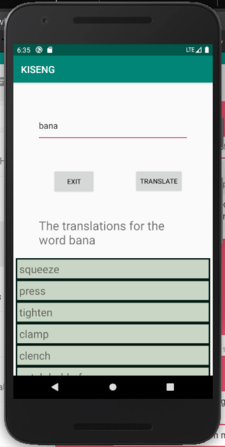
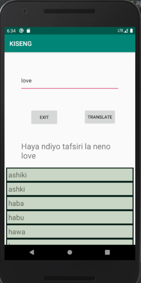

# mini-kiswahili-english-translator

This a mini android project for translating **english** to ** kiswahili ** and vice versa. 

We load a .cvs file that maps a **kiswahili words ** to **english words**.

We use a recyclerview to populate the visualize the translation. 

